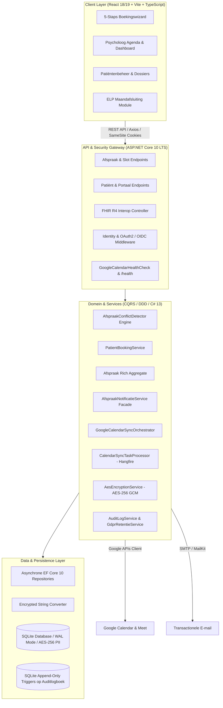

# Case Study: Enterprise Healthcare Practice & Patient Portal
**Architect & Full-Stack Developer**: Gregory Buts  
**Stack**: ASP.NET Core 10 LTS Web API, C# 13, Entity Framework Core 10, React 18/19, TypeScript, Tailwind CSS, Hangfire, HL7 FHIR R4  
**Domein**: Klinische Psychologie & Geestelijke Gezondheidszorg (Eerstelijnspsychologische Zorg / ELP)

---

## 📌 Executive Summary

Voor een drukke psychologenpraktijk met conventie- en privéraadplegingen ontwierp en realiseerde ik een **state-of-the-art afsprakenbeheer- en patiëntenportaal**. Het systeem vervangt gefragmenteerde papieren en e-mailprocessen door een end-to-end geautomatiseerde workflow met strikte medische privacy (**AES-256 GCM veldencryptie**), 100% gegarandeerde preventie van dubbele boekingen (**C# 13 Lock & concurrency engine**), realtime tweewegs **Google Calendar synchronisatie**, en geautomatiseerde sessieopvolging volgens de officiële **Belgische RIZIV/ELP-conventie**.

```
+---------------------------------------------------------------------------------------+
|                                     PORTFOLIO IMPACT                                  |
+---------------------------------------------------------------------------------------+
|  • 0% Race Conditions / Double Bookings in 50-thread concurrent stress load tests     |
|  • 92.7% Geautomatiseerde Code Coverage (812 xUnit, 406 Vitest — 1.218 Tests Totaal)  |
|  • 100% GDPR & Medische Data-isolatie via transparante AES-256 DB Veldversleuteling   |
|  • Onweerlegbare Append-Only Audit Trail met SQLite DB Triggers (AVG Art. 5(2))       |
|  • Geautomatiseerde RIZIV 8-sessies contingent tracking en registratie-export         |
|  • HL7 FHIR R4 interoperabiliteitslaag voor EPD/EHR communicatie                      |
|  • Long-Term Support (LTS) gegarandeerd op .NET 10 tot november 2028                 |
+---------------------------------------------------------------------------------------+
```

---

## 🏛️ Systeemarchitectuur & Ontwerpprincipes

Het platform scheidt lees- en schrijfmodellen volgens **CQRS (Command Query Responsibility Segregation)**, zoals vastgelegd in [ADR-005](vault/01%20-%20Architecture/ADRs/ADR-005-CQRS-and-DDD-Separation.md): overzichten en gefilterde tabellen draaien op projecties met `AsNoTracking`, terwijl schrijfoperaties binnen atomaire transacties lopen. Waar [ADR-023](vault/01%20-%20Architecture/ADRs/ADR-023-Servicelaag-Boven-Tactische-DDD.md) initieel koos voor domeinlogica in services, is de architectuur doelbewust geëvolueerd naar een **rijke `Afspraak` aggregate ([ADR-034](vault/01%20-%20Architecture/ADRs/ADR-034-Domeinregels-Op-De-Afspraak-Aggregate.md))** die haar eigen statusovergangen en invariants bewaakt, ondersteund door een asynchrone repositorylaag ([ADR-029](vault/01%20-%20Architecture/ADRs/ADR-029-Asynchrone-Repositorylaag.md)) en één centrale `AfspraakConflictDetector` ([ADR-030](vault/01%20-%20Architecture/ADRs/ADR-030-Een-Conflictdetector-Voor-Beide-Boekingspaden.md)).



---

## 🛠️ Technische Diepgang: Complexe Engineering Uitdagingen

### 1. Concurrency Control & Eén Centrale Conflictdetector
*   **De Uitdaging**: In een online patiëntenportaal proberen meerdere cliënten of de psycholoog zelf gelijktijdig hetzelfde vrije consultatieslot te reserveren.
*   **De Oplossing**:
    *   Ontwikkeling van een geharmoniseerde `AfspraakConflictDetector` ([ADR-030](vault/01%20-%20Architecture/ADRs/ADR-030-Een-Conflictdetector-Voor-Beide-Boekingspaden.md)) en `SlotCalculator` engine met vaste buffertijden (10–15 minuten rusttijd) en pauzeblokken.
    *   Implementatie van `System.Threading.Lock` en database transactie-isolatie in EF Core 10: concurrerende boekingspogingen worden direct afgevangen en atomair afgewezen (`HTTP 409 Conflict`) zonder database-corruptie.
    *   Ondersteund door 50-thread multi-threaded xUnit concurrency stress-tests (`BookingConcurrencyTests.cs`).
    *   Open-source referentie: [slotallocatie onder gelijktijdigheid](https://github.com/GregoryButs/Slotcalculator-showcase) — 50 parallelle aanvragen, 1× `201` en 49× `409`.

### 2. Privacy-by-Design, Onveranderbare Audit Trail & GDPR Compliance
*   **De Uitdaging**: Medische en persoonsgegevens (PII) mogen niet in klaartekst op schijf staan, en dossierinzages moeten onweerlegbaar en onveranderbaar auditeerbaar zijn conform AVG art. 5(2) en het medisch beroepsgeheim.
*   **De Oplossing**:
    *   Transparante AES-256 GCM veld-encryptie via EF Core `EncryptedStringConverter` op Rijksregisternummers, telefoonnummers en consultatienotities, inclusief automatische opstart-backfill door `VeldEncryptieBackfiller`.
    *   **Append-Only Audit Trail**: SQLite database triggers blokkeren fysiek elke `UPDATE` en `DELETE` op `AuditLogboek` (`RAISE(ABORT)`). De therapeut auditeert dossierinzages via `/api/audit/patient/{patientId}`, terwijl cliënten via `/api/audit/mijn-inzages` transparant zien wie hun dossier heeft geraadpleegd (AVG Art. 15).
    *   **Server-Side Toestemming**: HMAC-SHA256 validatie over consent-teksten en gepseudonimiseerde IP-adressen via `/api/toestemming` en `/api/toestemming/mijn`.
    *   **Geautomatiseerde Retentie**: Maandelijkse Hangfire-taak die verlaten online aanmeldingen na 2 jaar anonimiseert, conform AVG art. 5(1)(e).
    *   **Dataportabiliteit & Rechten**: Machine-leesbare JSON dossierexport (AVG Art. 15 & 20) via `/api/patientportaal/mijn-dossier` en ondersteuning voor vertrouwenspersonen/vertegenwoordigers (Belgische Wet Patiëntenrechten).

### 3. RIZIV / ELP Conventie Contingent & Maandafsluiting
*   **De Uitdaging**: In de Belgische Eerstelijnspsychologische Zorg (ELP) heeft een patiënt recht op maximaal 8 geconventioneerde sessies per kalenderjaar. Het overschrijden van dit contingent resulteert in niet-terugbetaalde zorg.
*   **De Oplossing**:
    *   Domein-invariants in de `Afspraak` aggregate die real-time het sessiesaldo bewaken.
    *   Een gespecialiseerde `ElpMaandafsluiting` module in React met TanStack Table: signaleert ontbrekende rijksregisternummers, houdt ingegeven sessies bij en exporteert de selectie als CSV voor registratie in het eHealth/ELP-portaal.

### 4. Resiliente 2-Weg Google Calendar Sync, Notificatie Facade & Duurzame Wachtrij
*   **De Uitdaging**: Kalendersynchronisatie en transactionele e-mails mogen kerntransacties niet vertragen en moeten deploys en herstarts overleven.
*   **De Oplossing**:
    *   Opsplitsing conform SRP ([ADR-031](vault/01%20-%20Architecture/ADRs/ADR-031-Google-Agendakoppeling-Opgesplitst.md)) in `GoogleCalendarClientProvider`, `GoogleCalendarEventMapper` en `GoogleCalendarSyncReconciler`.
    *   Duurzame agendawachtrij via Hangfire (`CalendarSyncTaskProcessor`, [ADR-033](vault/01%20-%20Architecture/ADRs/ADR-033-Duurzame-Agendawachtrij.md)).
    *   `AfspraakNotificatieService` ([ADR-032](vault/01%20-%20Architecture/ADRs/ADR-032-Neveneffecten-Achter-Een-Notificatie-Facade.md)) ontkoppelt e-mailverzending en herinneringen.
    *   `GoogleCalendarHealthCheck` met graceful `Degraded` ondersteuning zodat credential-onderbrekingen de praktijk niet uit rotatie halen.

---

## 📊 Kwaliteitsborging & Testresultaten

Het project is gebouwd volgens een strikte Test-Driven en Behavior-Driven aanpak:

| Testcategorie | Framework | Scope | Resultaat |
| :--- | :--- | :--- | :--- |
| **Unit & Concurrency Tests** | xUnit / Moq | Domeinlogica, `SlotCalculator`, ELP contingent, AES encryptie, Health Checks (65+ bestanden) | 100% Pass (**812 tests**) |
| **Concurrency Stress Tests** | xUnit / Multi-threaded | Parallelle reserveringen op hetzelfde tijdslot (50 threads) | 0 Race Conditions (1 toegekend, 49 geweigerd) |
| **Integratie & Health Tests**| ASP.NET TestHost | API Endpoints, OAuth2/OIDC flows, IDOR, `GoogleCalendarHealthCheck` | 100% Pass |
| **Model Snapshot Tests**      | EF Core Regression | Detectie van schema-drift en snapshot integriteit | 100% Pass |
| **Frontend Component Tests**  | Vitest / Testing Library | Booking Wizard, drag-selectie, praktijkuren, modals, server-state (50 bestanden) | 100% Pass (**406 tests**) |
| **Code Coverage**             | Coverlet / ReportGenerator | Backend & Frontend gecombineerd (**1.218 tests totaal**) | **92.7% Dekking** |

---

## 💡 Wat toont dit project?

1.  **Lead C# / .NET Architectuur**: Ervaring met .NET 10 LTS, C# 13 syntax (`Lock`, collection expressions), EF Core 10 asynchrone repositories, dependency injection, caching, health checks en duurzame Hangfire achtergrondtaken.
2.  **Architecturaal Inzicht**: Begrip van waarom en hoe je lees/schrijf-scheiding (CQRS), een expliciete domeintaal en Architecture Decision Records toepast — inclusief de evolutie naar een rijke `Afspraak` aggregate root met geharmoniseerde conflictdetectie.
3.  **Modern Frontend Vakmanschap**: React 18/19, TypeScript, Tailwind CSS, TanStack Query v5, TanStack Table v8, en responsive drag-to-select interacties.
4.  **Security & Compliance Focus**: Niet alleen bouwen wat werkt, maar bouwen wat compliant en juridisch-technisch aantoonbaar is (onweerlegbare SQLite append-only audit trail met database triggers, AES-256 GCM veldencryptie, AVG/GDPR, Wet Patiëntenrechten, runbooks voor continuïteit en datalekken).
