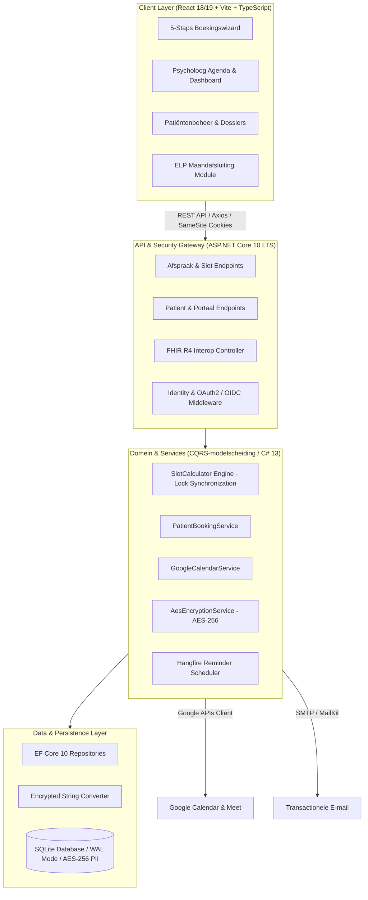

# Case Study: Enterprise Healthcare Practice & Patient Portal
**Architect & Full-Stack Developer**: Gregory Buts  
**Stack**: ASP.NET Core 10 LTS Web API, C# 13, Entity Framework Core 10, React 18/19, TypeScript, Tailwind CSS, Hangfire, HL7 FHIR R4  
**Domein**: Klinische Psychologie & Geestelijke Gezondheidszorg (Eerstelijnspsychologische Zorg / ELP)

---

## 📌 Executive Summary

Voor een drukke psychologenpraktijk met conventie- en privéraadplegingen ontwierp en realiseerde ik een **state-of-the-art afsprakenbeheer- en patiëntenportaal**. Het systeem vervangt gefragmenteerde papieren en e-mailprocessen door een end-to-end geautomatiseerde workflow met strikte medische privacy (**AES-256 GCM veldencryptie**), 100% gegarandeerde preventie van dubbele boekingen (**C# 13 Lock & concurrency engine**), realtime tweewegs **Google Calendar synchronisatie**, en geautomatiseerde sessieopvolging volgens de officiële **Belgische RIZIV/ELP-conventie**.

```
+---------------------------------------------------------------------------------------+
|                                     PORTFOLIO IMPACT                                  |
+---------------------------------------------------------------------------------------+
|  • 0% Race Conditions / Double Bookings in 50-thread concurrent stress load tests     |
|  • 90%+ Geautomatiseerde Code Coverage (695 xUnit, 372 Vitest, 1.067 Tests Totaal)       |
|  • 100% GDPR & Medische Data-isolatie via transparante AES-256 DB Veldversleuteling   |
|  • Geautomatiseerde RIZIV 8-sessies contingent tracking en registratie-export         |
|  • HL7 FHIR R4 interoperabiliteitslaag voor EPD/EHR communicatie                      |
|  • Long-Term Support (LTS) gegarandeerd op .NET 10 tot november 2028                 |
+---------------------------------------------------------------------------------------+
```

---

## 🏛️ Systeemarchitectuur & Ontwerpprincipes

Het platform scheidt lees- en schrijfmodellen volgens **CQRS (Command Query Responsibility Segregation)**, zoals vastgelegd in ADR-005: overzichten en gefilterde patiënttabellen draaien op projecties met `AsNoTracking`, terwijl schrijfoperaties via domeinservices binnen atomaire transacties lopen die de invarianten bewaken. Het domeinvocabulaire (`Afspraak`, `Tijdslot`, `ELPStatus`, `Reeks`) en de praktijkregels zijn expliciet gemodelleerd en gedocumenteerd. De tactische DDD-patronen — aggregates en value objects — zijn bewust **niet** toegepast; die afweging staat in ADR-023.



---

## 🛠️ Technische Diepgang: 4 Complexe Engineering Uitdagingen

### 1. Concurrency Control & Double-Booking Preventie
*   **De Uitdaging**: In een online patiëntenportaal proberen meerdere cliënten of de psycholoog zelf gelijktijdig hetzelfde vrije consultatieslot te reserveren.
*   **De Oplossing**:
    *   Ontwikkeling van een atomaire `SlotCalculator` engine die werkt met vaste buffertijden (10–15 minuten rusttijd tussen consultaties) en pauzeblokken.
    *   Implementatie van `System.Threading.Lock` en `HeeftConflict()` validaties in EF Core 10 zodat concurrerende boekingspogingen direct worden afgevangen en atomair falen (`HTTP 409 Conflict`) zonder database-corruptie.
    *   Ondersteund door geautomatiseerde multi-threaded xUnit concurrency stress-tests (`BookingConcurrencyTests.cs`).
    *   De kern van dit mechanisme is los uitgewerkt in een publieke proof of concept met een generiek domein: [slotallocatie onder gelijktijdigheid](https://github.com/GregoryButs/Slotcalculator-showcase) — vijftig parallelle aanvragen, 1× `201` en 49× `409`, gemeten op HTTP-niveau.

### 2. Privacy-by-Design & AES-256 Veld-Encryptie (GDPR)
*   **De Uitdaging**: Medische en persoonsgegevens (PII) mogen niet leesbaar in plaintext in de database staan om datalekken bij database-diefstal uit te sluiten.
*   **De Oplossing**:
    *   Implementatie van een custom `EncryptedStringConverter` in Entity Framework Core gekoppeld aan een cryptografische `AesEncryptionService`.
    *   Data wordt transparant geëncrypt met AES-256 (met unieke IV per veld en multi-key rotatie) bij `SaveChanges()` en uitsluitend in-memory gedecrypt wanneer geauthenticeerde en geautoriseerde handlers de data opvragen.
    *   Strikte mitigatie van BOLA / IDOR (Broken Object-Level Authorization) via per-request ownership validaties.

### 3. RIZIV / ELP Conventie Contingent & Maandafsluiting
*   **De Uitdaging**: In de Belgische Eerstelijnspsychologische Zorg (ELP) heeft een patiënt recht op maximaal 8 geconventioneerde sessies per kalenderjaar. Het overschrijden van dit contingent resulteert in niet-terugbetaalde zorg.
*   **De Oplossing**:
    *   Domein-invariants in de `Afspraak` aggregate die real-time het sessiesaldo bijhouden.
    *   Een gespecialiseerde `ElpMaandafsluiting` module in React met TanStack Table: ze toont de ELP-sessies van de maand, signaleert een ontbrekend rijksregisternummer, houdt bij wat al is ingegeven en exporteert de lijst als CSV voor registratie in het eHealth/ELP-portaal.

### 4. Realtime 2-Weg Google Calendar Synchronisatie & Hangfire Workers
*   **De Uitdaging**: Afspraken die de behandelaar in haar persoonlijke Google Agenda aanpast of toevoegt, moeten realtime gesynchroniseerd worden met het interne platform om blinde vlekken te voorkomen.
*   **De Oplossing**:
    *   Tweeweg synchronisatielaag met de Google Calendar v3 API, inclusief automatische generatie van unieke Google Meet vergaderlinks bij teleconsultaties.
    *   Asynchrone taakverwerking via Hangfire voor transactionele HTML e-mailbevestigingen met dynamisch gegenereerde `.ics` agenda-bestanden en automatische 24-uurs herinneringen (met 25s graceful drain).

---

## 📊 Kwaliteitsborging & Testresultaten

Het project is gebouwd volgens een strikte Test-Driven en Behavior-Driven aanpak:

| Testcategorie | Framework | Scope | Resultaat |
| :--- | :--- | :--- | :--- |
| **Unit & Concurrency Tests** | xUnit / Moq | Domeinlogica, `SlotCalculator`, ELP teller, AES encryptie (62 bestanden) | 100% Pass (695 tests) |
| **Concurrency Stress Tests** | xUnit / Multi-threaded | Parallelle reserveringen op hetzelfde tijdslot (50 threads) | 0 Race Conditions (1 toegekend, 49 geweigerd) |
| **Integratietests** | ASP.NET TestHost | API Endpoints, OAuth2/OIDC Auth flows, IDOR beveiliging | 100% Pass |
| **Model Snapshot Tests**| EF Core Regression | Detectie van schema-drift en snapshot integriteit | 100% Pass |
| **Frontend Tests** | Vitest / Testing Library | Booking Wizard stappen, validaties, modals, server-state (47 bestanden) | 100% Pass (372 tests) |
| **Code Coverage** | Coverlet / ReportGenerator | Backend & Frontend gecombineerd (1.067 tests) | **> 90% Dekking** |

---

## 💡 Wat toont dit project aan potentiële werkgevers?

1.  **Lead C# / .NET Architectuur**: Ervaring met .NET 10 LTS, C# 13 syntax (`Lock`, collection expressions), EF Core 10 geavanceerde mapping, dependency injection, caching en zero-downtime achtergrondworkers.
2.  **Architecturaal Inzicht**: Begrip van waarom en hoe je lees/schrijf-scheiding, een expliciete domeintaal en Architecture Decision Records toepast — inclusief de afweging om tactische DDD-patronen juist *niet* toe te passen (ADR-023).
3.  **Modern Frontend Vakmanschap**: React 18/19, TypeScript, Tailwind CSS, TanStack Table, responsive ontwerpen met focus op gebruiksvriendelijkheid voor patiënten én artsen.
4.  **Security & Compliance Focus**: Niet alleen bouwen wat werkt, maar bouwen wat veilig is (OWASP Top 10 mitigatie, cryptografie, privacywetgeving).
