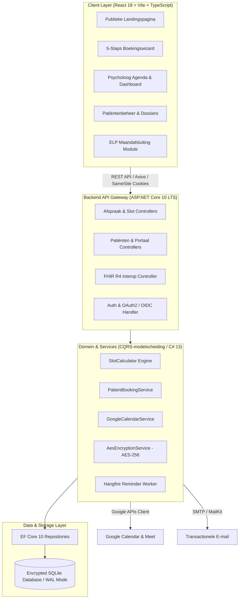

# Clinical Healthcare & EHR Practice Platform – Case Study

[](https://dotnet.microsoft.com/)
[](https://reactjs.org/)
[](https://www.typescriptlang.org/)
[](https://tailwindcss.com/)
[](https://hl7.org/fhir/R4/)
[](./api.html)
[]()

> **Architect & Full-Stack Developer**: Gregory Buts  
> **Platform**: De Verstandhouding – Clinical Appointment & Practice Management System  
> **Runtime**: .NET 10 LTS (C# 13) met Long-Term Support tot november 2028  
> **Interactive Showcase**: Open [`[index.html]`](https://gregorybuts.github.io/de-verstandhouding-showcase/index.html) in any browser or visit the live deployment.

---

## 🏛️ Systeemarchitectuur & Domeinmodel (CQRS-modelscheiding)



---

## ⚡ Belangrijkste Technische Hoogtepunten

### 1. Concurrency Control & Double-Booking Preventie
*   Atomaire beschikbaarheidsengine (`SlotCalculator`) met instelbare openingstijden, pauzes en vaste 10–15 minuten buffertijden.
*   Transactie-isolatie in Entity Framework Core waardoor overlappende boekingen direct worden afgevangen (`HeeftConflict()`).
*   **Resultaat**: 0% race-conditions en double-bookings in multi-threaded xUnit stress tests.

### 2. Privacy-by-Design & AES-256 Encryptie (GDPR)
*   Gevoelige medische en persoonsgegevens (PII) worden transparant versleuteld met **AES-256** (met unieke IV's en multi-key rotatie) via een custom EF Core `EncryptedStringConverter`.
*   Data wordt uitsluitend in-memory gedecrypt voor geautoriseerde verzoeken, met strikte mitigatie van BOLA / IDOR.

### 3. RIZIV / ELP Conventie Contingent Tracking
*   Real-time domeinbewaking van het 8-sessies contingent per cliënt volgens de Belgische eerstelijnspsychologische zorgconventie.
*   1-Click export van maandafsluitingen en RIZIV-facturatielijsten.

### 4. 2-Weg Realtime Google Calendar Sync & Asynchrone Jobs
*   Bi-directionele synchronisatie met Google Calendar v3 API en dynamische Google Meet linkaanmaak voor videoconsultaties.
*   Asynchrone achtergrondworkers via **Hangfire** voor 24u-herinneringsmails met ICS-kalenderbijlagen.

---

## 📁 Showcase Structuur
```text
├── index.html                  # Interactieve showcase webpagina in officiële praktijkhuisstijl
├── PORTFOLIO_CASE_STUDY.md     # Volledige technische documentatie & architectuurbeschrijving
├── cv_summary_snippets.md      # CV en LinkedIn teksten (Nederlands & Engels)
└── assets/                     # Officiële merklogo's, vector assets en praktijkfoto's
```

---

## 👤 Auteur & Contact
**Gregory Buts**  
*Lead Full-Stack .NET & React Software Architect*  
GitHub: [github.com/GregoryButs](https://github.com/GregoryButs)
