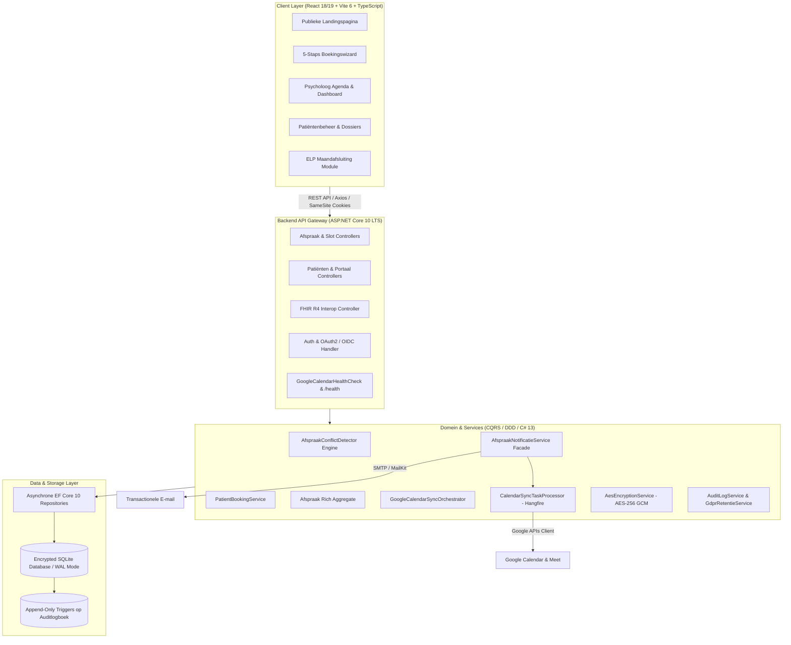

# Clinical Healthcare & EHR Practice Platform – Case Study

### ▶ [Bekijk de live case study](https://gregorybuts.github.io/de-verstandhouding-showcase/)

*Deze repository bevat de bron. De gerenderde pagina staat op de link hierboven.*

[](https://dotnet.microsoft.com/)
[](https://reactjs.org/)
[](https://www.typescriptlang.org/)
[](https://tailwindcss.com/)
[](https://hl7.org/fhir/R4/)
[](./api.html)
[]()

> **Architect & Full-Stack Developer**: Gregory Buts  
> **Platform**: De Verstandhouding – Clinical Appointment & Practice Management System  
> **Runtime**: .NET 10 LTS (C# 13) met Long-Term Support tot november 2028  
> **Live case study**: **<https://gregorybuts.github.io/de-verstandhouding-showcase/>**
> **Uitgelicht**: [Waarom een unieke index dit niet kan](https://gregorybuts.github.io/de-verstandhouding-showcase/concurrency.html) — over het afdwingen van een invariant die over de verhouding tussen rijen gaat
> **API-contract**: <https://gregorybuts.github.io/de-verstandhouding-showcase/api.html>
> **Concurrency-PoC**: <https://github.com/GregoryButs/Slotcalculator-showcase>

---

## 🏛️ Systeemarchitectuur & Domeinmodel (CQRS-modelscheiding)



---

## ⚡ Belangrijkste Technische Hoogtepunten

### 1. Concurrency Control & Centrale Conflictdetector
*   Atomaire beschikbaarheidsengine (`SlotCalculator`) en centrale `AfspraakConflictDetector` ([ADR-030](vault/01%20-%20Architecture/ADRs/ADR-030-Een-Conflictdetector-Voor-Beide-Boekingspaden.md)) met instelbare openingstijden, pauzes en vaste 10–15 minuten buffertijden.
*   Rijke domein-invariants op de `Afspraak` aggregate ([ADR-034](vault/01%20-%20Architecture/ADRs/ADR-034-Domeinregels-Op-De-Afspraak-Aggregate.md)) en asynchrone datatoegang ([ADR-029](vault/01%20-%20Architecture/ADRs/ADR-029-Asynchrone-Repositorylaag.md)).
*   **Resultaat**: 0% race-conditions en double-bookings in 50-thread multi-threaded xUnit stress tests.

### 2. Privacy-by-Design, Onveranderbare Audit Trail & GDPR Compliance
*   Gevoelige medische en persoonsgegevens (PII) worden transparant versleuteld met **AES-256 GCM** (met unieke IV's en multi-key rotatie) via EF Core `EncryptedStringConverter`, met automatische backfill (`VeldEncryptieBackfiller`).
*   Onweerlegbare **append-only audit trail** op dossierinzages met SQLite database triggers die `UPDATE` en `DELETE` blokkeren ([ADR-027](vault/01%20-%20Architecture/ADRs/ADR-027-Dossier-Audit-Trail.md)).
*   Server-side HMAC-SHA256 toestemmingsvalidatie en geautomatiseerde 2-jarige GDPR-retentie via Hangfire ([ADR-028](vault/01%20-%20Architecture/ADRs/ADR-028-Toestemmingsregistratie-en-Retentie.md)).
*   Gestandaardiseerde JSON machine-leesbare dossierexport (GDPR Art. 15/20) en Wet Patiëntenrechten contactpersonen.

### 3. RIZIV / ELP Conventie Contingent Tracking
*   Real-time domeinbewaking van het 8-sessies contingent per cliënt volgens de Belgische eerstelijnspsychologische zorgconventie.
*   CSV-export van de maandafsluiting, klaar voor registratie in het eHealth/ELP-portaal.

### 4. Resiliente 2-Weg Google Calendar Sync & Duurzame Hangfire Wachtrij
*   Koppeling opgesplitst conform SRP ([ADR-031](vault/01%20-%20Architecture/ADRs/ADR-031-Google-Agendakoppeling-Opgesplitst.md)), met duurzame verwerking via Hangfire (`CalendarSyncTaskProcessor`, [ADR-033](vault/01%20-%20Architecture/ADRs/ADR-033-Duurzame-Agendawachtrij.md)).
*   Ontkoppelde notificatiefacade ([ADR-032](vault/01%20-%20Architecture/ADRs/ADR-032-Neveneffecten-Achter-Een-Notificatie-Facade.md)) en `GoogleCalendarHealthCheck` met graceful `Degraded` status.

---

## 📁 Showcase Structuur
```text
├── index.html                  # Interactieve showcase webpagina in officiële praktijkhuisstijl
├── concurrency.html            # Uitgelichte deep dive: invarianten over rijen vs unieke indices
├── api.html                    # Redocly OpenAPI UI met alle 62 endpoints & schemas
├── openapi.json                # Volledige OpenAPI 3.0.1 specificatie
├── coverage-badge.svg          # Test coverage status badge (92.7%)
├── PORTFOLIO_CASE_STUDY.md     # Volledige technische documentatie & architectuurbeschrijving
├── cv_summary_snippets.md      # CV en LinkedIn teksten (Nederlands & Engels)
└── assets/                     # Officiële merklogo's, vector assets en praktijkfoto's
```

---

## 👤 Auteur & Contact
**Gregory Buts**  
*Lead Full-Stack .NET & React Software Architect*  
GitHub: [github.com/GregoryButs](https://github.com/GregoryButs)
